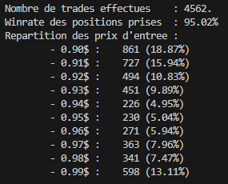
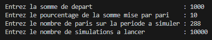
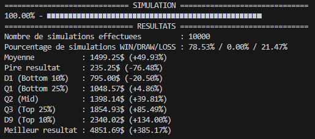
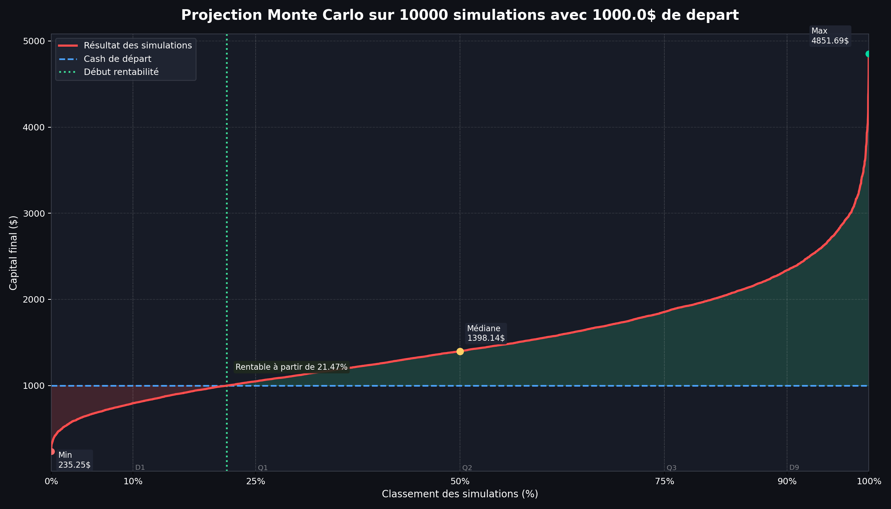

# Trading Bot Simulator
Ce script permet d'extrapoler les resultats du bot de trading (sous forme de .json) puis de simuler des projections avec un algorithme de Monte-Carlo.
## Fonctionnement
### Installer les packages
```
python -m pip install -U pip
python -m pip install -U matplotlib
```
### Lancer le script
Si le fichier trades.json se trouve a la racine du projet, il sera automatiquement detecte.
Sinon le script demandera d'indiquer le chemin vers le fichier de sauvegarde.

Le script recuperera les informations de tous les trades pris et affichera :
- Le nombre de trade traites.
- Le taux de trades gagnants.
- La repartition des prix d'entree des positions prises.


### Fournir les informations initiales
Le script demandera ensuite :

| Information demandee            | Unite | Exemple input | Exemple output            |
| :---:                           | :---: | :---:         | :---:                     |
| Somme de depart                 | $     | 1000          | 1000$                     |
| Pourcentage cash par trade      | %     | 10            | 10% par trade             |
| Nombre de trades par simulation | -     | 288           | 288 trades par simulation |
| Nombre de simulations           | -     | 100000        | 100000 simulations        |

En Python, les nombres a virgules s'ecrivent a l'anglosaxone (**10.55** plutot que **10,55**).

A titre indiquatif, avec 1 trade / 5 minutes, voici quelques valeurs a retenir :
- 1 heure = 12 trades.
- 1 jour = 288 trades.
- 1 semaine = 2016 trades.
- 30 jours = 8640 trades.


## Le script affiche les resultats
Une fois les simulations terminees, le script genere un graphique recapitulatif et l'enregistre sous *projections.png*, puis affiche le resultat de ses analyses dans le terminal.



